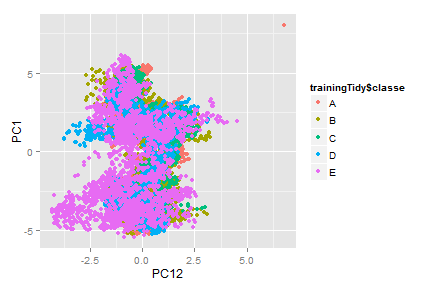
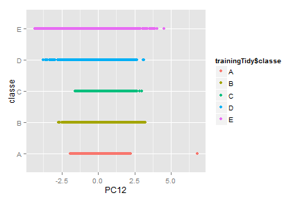
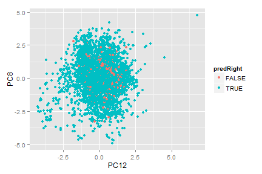

Practical Machine Learning Course; Course Project 

Predicting the quality of a physical activity
==========================================================================

# Executive Summary
In this report we investigate the question "How well people perform physical activity such as barbell lifts?". To address this question we use data collected from 6 participants wearing accelerometers on their belt, forearm, arm, and dumbbell. They were asked to perform barbell lifts correctly and incorrectly in 5 different ways. Our goal is to predict the manner in which the participants did the exercise. First, we perform data preprocessing to remove covariates with many missing values, near zero covariates and  to reduce the data to a smaller sub-space (based on PCA) where the new variables are uncorrelated with one another. Second, we build a machine learning algorithm based on random forest. Last, we estimate the out-of-sample error using a cross-validation approach.    

# Data Loading

First we download the [training] (https://d396qusza40orc.cloudfront.net/predmachlearn/pml-training.csv) and [testing] (https://d396qusza40orc.cloudfront.net/predmachlearn/pml-testing.csv) data for the project, both coming from this source: http://groupware.les.inf.puc-rio.br/har. Then, we read the .cvs files in R as shown below. The training and testing data are comma-separated values (csv) files where missing values are coded as NA. The training data set has 19 622 observations of 160 variables and the testing data set has 20 observations of 160 variables. 
 

```r
library(caret)
```

```
## Loading required package: lattice
## Loading required package: ggplot2
```

```r
library(randomForest)
```

```
## randomForest 4.6-10
## Type rfNews() to see new features/changes/bug fixes.
```

```r
training <- read.csv("./pml-training.csv")
testing <- read.csv("./pml-testing.csv")
dim(training)
```

```
## [1] 19622   160
```

```r
dim(testing)
```

```
## [1]  20 160
```


The outcome we would like to predict is the "classe" variable, which is a factor with the following 5 levels: 
 - "A"  Unilateral Dumbbell Biceps Curl performed exactly according to the specification  
 - "B"  throwing the elbows to the front  
 - "C"  lifting the dumbbell only halfway  
 - "D"  lowering the dumbbell only halfway  
 - "E"  throwing the hips to the front.

Summary of the number of observations in each class is shown below and illustrates that they are fairly equally distributed with slight prevalance of class A:

```r
table(training$classe)
```

```
## 
##    A    B    C    D    E 
## 5580 3797 3422 3216 3607
```

Note that the testing dataset will be used at the very end to generate 20 predictions for assignment submission and it would not be used further in this report. However, it should go throughout all preprocessing procedures performed on the training dataset and described in the chapter below.

# Data Preprocessing

## Missing values
From the training dataset summary **str(training)** (not printed here due to very long output) it appears there are a lot of missing values, which is a common problem with raw data from personal activity sensors.  

First, let's calculate the % of missing values in each column and only select those columns which have at least 50% non-missing values. In fact, most of the columns eleminated by this procedure have 98% missing values, e.g. columns 18, 19, etc.. In this way the number of predictors is reduced from 160 to 93. 


```r
colInd <- c()
for (i in seq_len(ncol(training))) {
    if (mean(is.na(training[, i])) < 0.5) {
        colInd <- c(colInd, i)
    }
}
trainingTidy <- training[, colInd]
dim(trainingTidy)
```

```
## [1] 19622    93
```


## Removing near zero covariates
Some of our predictors might have few unique values that occur with very low frequencie.
Then, these predictors may become zero-variance predictors when the data are split
into cross-validation/bootstrap sub-samples. Hence, let's identified and eliminated prior to modeling the "near-zero-variance" predictors. In this way the number of predictors is reduced from 93 to 59. 


```r
nzv <- nearZeroVar(trainingTidy)
trainingTidy <- trainingTidy[, -nzv]
dim(trainingTidy)
```

```
## [1] 19622    59
```


## Removing irrelevant columns 
Further,  we remove the first 6 columns related to user names, raw timestamps, num of windows, etc., resulting in 53 candidate predictors.


```r
trainingTidy <- trainingTidy[, -c(1:6)]
```

 
## Data splitting
To estimate the testing set accuracy (out-of-sample error) we follow a cross-validation approach on the trainingTidy set:

1. Split the trainigTidy into training and testing subsets
2. Build a model on the training subset of trainingTidy
3. Evaluate the out-of-sample error on the testing subset
4. Repeat and average the estimated errors. 

Below we show Steps 1-3. We do not perform Step 4 since the model we select has built-in resampling and averaging of the estimated errors itself. 


```r
set.seed(3433)
inTrain <- createDataPartition(y = trainingTidy$classe, p = 0.7, list = FALSE)
trainingTidy <- trainingTidy[inTrain, ]
testingTidy <- trainingTidy[-inTrain, ]
dim(trainingTidy)
```

```
## [1] 13737    53
```

```r
dim(testingTidy)
```

```
## [1] 4129   53
```


## PCA
As a final step of data preprocessing we'll use principal component analysis (PCA) to transform the data to a smaller sub-space where the new variables are uncorrelated with one another. Since PCA is very sensitive to outliers as well variables with skewed distributions we performed first BoxCox transformation followed by PCA.


```r
# index of the outcome
outInd <- dim(trainingTidy)[2]
# preProcess() with method = (BoxCox, pca)
set.seed(3433)
preProc <- preProcess(trainingTidy[, -outInd], method = c("BoxCox", "pca"), 
    thresh = 0.8)
trainingPC <- predict(preProc, trainingTidy[, -outInd])
nComp <- preProc$numComp
```

The number of principal components needed to capture 80% of the variance is 12. Therefore, the final number of predictors we will use for predictive modelling is 12. 

# Exploratory data analysis 

Below a plot of predictors as well as a plot of outcome vs. a predictor.

```r
qplot(PC12, PC1, color = trainingTidy$classe, data = trainingPC)
```




```r
qplot(PC12, trainingTidy$classe, color = trainingTidy$classe, data = trainingPC, 
    ylab = "classe")
```




# Model fitting
Because of the characteristic noise in the activity sensor data we use a Random Forest model, which has excellent accuracy among current machine learning algorithms. 


```r
set.seed(32343)
modelFit <- train(trainingTidy$classe ~ ., method = "rf", data = trainingPC)
finMod <- modelFit$finalModel
```


Summary of the final model

```r
print(finMod)
```

```
## 
## Call:
##  randomForest(x = x, y = y, mtry = param$mtry) 
##                Type of random forest: classification
##                      Number of trees: 500
## No. of variables tried at each split: 2
## 
##         OOB estimate of  error rate: 3.96%
## Confusion matrix:
##      A    B    C    D    E class.error
## A 3807   23   41   26    9     0.02535
## B   66 2503   64   15   10     0.05831
## C   19   37 2308   27    5     0.03673
## D   22   11  108 2102    9     0.06661
## E    5   19   16   12 2473     0.02059
```

The accuracy on the training subset is:

```r
modelFit
```

```
## Random Forest 
## 
## 13737 samples
##    11 predictors
##     5 classes: 'A', 'B', 'C', 'D', 'E' 
## 
## No pre-processing
## Resampling: Bootstrapped (25 reps) 
## 
## Summary of sample sizes: 13737, 13737, 13737, 13737, 13737, 13737, ... 
## 
## Resampling results across tuning parameters:
## 
##   mtry  Accuracy  Kappa  Accuracy SD  Kappa SD
##   2     0.9       0.9    0.004        0.005   
##   7     0.9       0.9    0.005        0.006   
##   10    0.9       0.9    0.006        0.008   
## 
## Accuracy was used to select the optimal model using  the largest value.
## The final value used for the model was mtry = 2.
```

The accuracy on the testing subset (which is an **estimate of the out-of-sample error**) is:

```r
testingPC <- predict(preProc, testingTidy[, -outInd])
predTestingPC <- predict(modelFit, testingPC)
confusionMatrix(predTestingPC, testingTidy$classe)
```

```
## Confusion Matrix and Statistics
## 
##           Reference
## Prediction    A    B    C    D    E
##          A 1145   21   26   18    8
##          B   17  734   16    7    2
##          C    5   21  661   42   13
##          D   15    4    9  594    8
##          E    4    3    9   12  735
## 
## Overall Statistics
##                                         
##                Accuracy : 0.937         
##                  95% CI : (0.929, 0.944)
##     No Information Rate : 0.287         
##     P-Value [Acc > NIR] : < 2e-16       
##                                         
##                   Kappa : 0.92          
##  Mcnemar's Test P-Value : 1.21e-05      
## 
## Statistics by Class:
## 
##                      Class: A Class: B Class: C Class: D Class: E
## Sensitivity             0.965    0.937    0.917    0.883    0.960
## Specificity             0.975    0.987    0.976    0.990    0.992
## Pos Pred Value          0.940    0.946    0.891    0.943    0.963
## Neg Pred Value          0.986    0.985    0.982    0.977    0.991
## Prevalence              0.287    0.190    0.175    0.163    0.186
## Detection Rate          0.277    0.178    0.160    0.144    0.178
## Detection Prevalence    0.295    0.188    0.180    0.153    0.185
## Balanced Accuracy       0.970    0.962    0.947    0.936    0.976
```


The order of variable importance is:

```r
varImp(modelFit)
```

```
## rf variable importance
## 
##      Overall
## PC12   100.0
## PC8     91.8
## PC1     70.8
## PC5     64.1
## PC9     53.9
## PC3     46.2
## PC6     39.4
## PC2     30.1
## PC4     19.6
## PC10    16.8
## PC7     14.6
## PC11     0.0
```


Finally, let's plot FALSE predicted value using the 2 most important variables:

```r
predRight <- predTestingPC == testingTidy$classe
qplot(PC12, PC8, color = predRight, data = testingPC)
```




